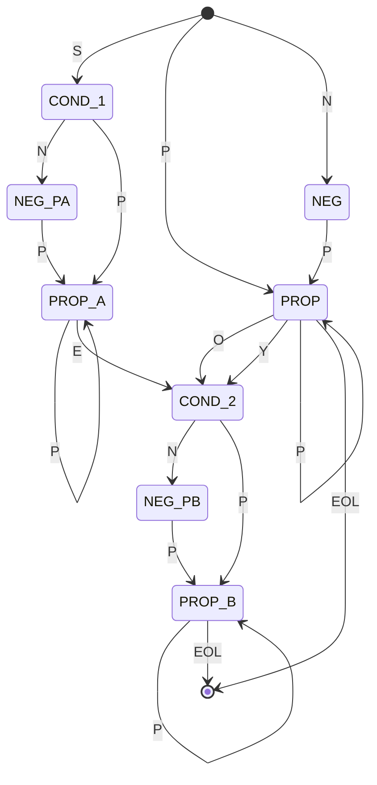

# Automata Finito

```mermaid
stateDiagram
    [*] --> COND_1 : S
    [*] --> PROP : P
    [*] --> NEG : N
    NEG --> PROP : P
    PROP --> COND_2 : O
    PROP --> COND_2 : Y
    PROP --> PROP : P

    COND_1 --> NEG_PA : N
    COND_1 --> PROP_A : P
    NEG_PA --> PROP_A : P

    PROP_A --> PROP_A : P
    PROP_A --> COND_2 : E
    COND_2 --> NEG_PB : N
    COND_2 --> PROP_B : P

    NEG_PB --> PROP_B : P
    PROP_B --> PROP_B : P


    PROP  --> [*]: EOL
    PROP_B  --> [*]: EOL

```